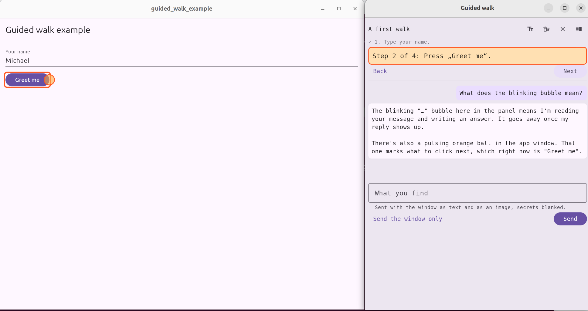

# flutter-guided-walk

Lets an AI agent guide a person through any Flutter app step by step, with pointers, a live chat and
the app's state, secrets blanked, in development builds only.

<picture></picture>

A panel beside the window says what to do next. A pulsing ball and a frame mark what to click.
The person writes what they find without leaving the app. Each message goes to the agent with the
window's state as text and an image of the window, with secrets blanked in both. The panel can also
open in a window of its own beside the app.

**Development builds only.** In a release build nothing of it is shown or sent. A development build
shows it only when started with a walk's folder, named by a variable the app chooses:

```bash
GUIDED_WALK=$HOME/my-walk flutter run -d linux
```

The package is a Flutter plugin. Its Dart part runs wherever Flutter does. A small Linux part names
and sizes the panel's own window; on other platforms that window opens at the app's usual size.

[](doc/guided-walk-example.png)

*The example app and the walk's panel in a window of its own. Click for the full size.*

## Getting started with Claude

The `example/` folder holds a small app and a walk through it. This leads Claude Code through it,
over MCP. Run every command in this repository's folder, as it stands.

1. **Have what it takes:** Flutter with its Linux desktop toolchain, and Claude Code.
2. **Start the example app** with its walk's folder:

   ```bash
   (cd example && GUIDED_WALK=$PWD/walk flutter run -d linux)
   ```

   The app opens with the walk's panel at its right edge. If the panel is not there, the walk was
   put away when it last ran: the signpost button at the right of the app's top bar brings it back.
3. **Tell Claude Code about the server, once.** In a second terminal:

   ```bash
   claude mcp add guided-walk -- dart run $PWD/bin/guided_walk_mcp.dart $PWD/example/walk
   ```

   It is added for this folder only (the local scope); *Setting it up in Claude Code* says how to
   add it for every folder instead.
4. **Start Claude Code in this folder:** `claude`. If it was already running, start it again: it
   loads its servers when it starts.
5. **Check that Claude found the server:** type `/mcp` in the session. `guided-walk` is listed as
   connected.
6. **Ask for a walk**, for instance:

   > Lead me through the example app with the guided walk: write a walk that has me type my name
   > and open the greeting, then wait for what I say and answer it.

   Claude writes the walk with `walk_set`, and the panel shows its first step, with a ball on what
   to click.
7. **Walk it.** Do what the panel says. Write in the field at the bottom of the panel and press
   *Send*: Claude receives it with the window's state and image, and its answer appears in the
   panel. The panel's top row opens it in a window of its own, sets its font and size, clears the
   conversation and puts the walk away.

**When something does not work:**
- **The server, started by hand in a terminal, prints a note and waits.** That is right: Claude
  Code starts it, not a person. Ctrl+C ends it.
- **`/mcp` does not list `guided-walk`:** it was added in another folder, or Claude Code was not
  started again after adding it.
- **The build fails on a missing `build/native_assets/linux`:** run `flutter clean` in `example/`
  and start again.

## Using it in an app

`pubspec.yaml`, until it is on pub.dev:

```yaml
dependencies:
  guided_walk:
    git:
      url: https://github.com/fuinorg/flutter-guided-walk.git
      ref: v0.2.0
```

`main.dart`:

```dart
import 'package:guided_walk/guided_walk.dart';

void main() {
  WidgetsFlutterBinding.ensureInitialized();
  // Started by the walk as its window of its own: the panel and nothing else.
  if (walkWindowPath() case final path?) {
    runApp(WalkWindowApp(path, theme: myTheme));
    return;
  }
  final walk = WalkSession.fromEnvironment(variable: 'MY_APP_WALK')?..start();
  runApp(MaterialApp(
    // Around the navigator, so the panel stays usable while a dialog is open.
    builder: walk == null ? null : (context, child) => WalkFrame(walk: walk, child: child!),
    home: const MyHome(),
  ));
}
```

- **Secrets:** wrap what must never be sent, such as a terminal, in `WalkSecret(child: …)`. Fields
  with `obscureText` are blanked already.
- **Choices of the app's own:** a step can wait for `filled:<key>`. Text fields and checkboxes are
  known; add a test for your own choice widgets to `walkChoices`.
- **Words:** `WalkPanelTexts` says the panel's few sentences in the app's own way or language.
- **Showing the walk again:** the person can put the walk away, and it starts put away the next
  time as well. `walk.hidden` says so, and `walk.show()` brings it back. **An app must offer that**,
  from a button in its top bar for instance, as the example does: without one, a walk put away
  stays away.

## The walk's folder

Everything goes through the folder, and stays on this computer:

| File | Written by | What it holds |
|---|---|---|
| `walk.json` | the agent | the walk: `{"title": …, "steps": [{"say": …, "at": …, "then": …}], "from": <step>}` |
| `comments.jsonl` | the app | one line per message: `at`, `text`, `step`, `stepSays`, `state`, `image` |
| `window-….png` | the app | the window as the message saw it, secrets blanked |
| `answers.jsonl` | the agent | one line per answer: `{"text": …}` |
| `conversation.jsonl` | the app | everything said, in order, read back when the app starts again |
| `panel-style.json`, `panel-window.json` | the app | the panel's font and size; whether it has its own window, and how large |
| `window.sock` | the app | while the panel has its own window: how the two talk |
| `status.json` | the app | what is shown now: the walk's title, the step and what it says, whether it is put away, whether the person waits for an answer; and the app's process (`pid`, `program`), to tell whether it still runs |
| `look-request.json` | the agent | `{"n": <number>}`: a request to look at the window now, one number higher than the last |
| `look.json`, `look-….png` | the app | the answer: the window's state and image, under the same number |
| `agent-read.json` | the MCP server | how many messages it handed to the agent |

The app rereads `walk.json` when it changes. A rewritten walk keeps its place, unless it names `from`.

## Connecting the agent

The agent and the app never talk to each other directly: they share the walk's folder. An agent
reaches it in one of two ways, and the app does not know which one is used.

**Through the files, without MCP**, where MCP may not be used at all. The agent writes `walk.json`
and appends to `answers.jsonl`, reads `status.json`, and waits for new lines in `comments.jsonl`,
with a script that ends when one arrives, for instance. To look at the window it writes
`look-request.json` and reads `look.json`. Each file is described above.

**Through MCP.** `bin/guided_walk_mcp.dart` serves the same folder as an MCP server over standard
input and output. The agent starts it itself, so nobody else reaches it; there is no port and no
token, and the folder's permissions decide who may read the walk. It needs nothing but Dart:

```bash
dart run <this repository>/bin/guided_walk_mcp.dart <the walk's folder>
```

In Claude Code, for one project, as `.mcp.json` beside it:

```json
{
  "mcpServers": {
    "guided-walk": {
      "command": "dart",
      "args": ["run", "/path/to/flutter-guided-walk/bin/guided_walk_mcp.dart", "/path/to/the/walk"]
    }
  }
}
```

| Tool | What it does |
|---|---|
| `walk_status` | which walk and step are shown, whether it is put away, whether the person waits for an answer |
| `walk_set` | writes the walk: `title`, `steps`, and `from` to show a given step |
| `walk_say` | answers the person in the panel |
| `walk_wait` | waits until the person says something, or the walk sends the window by itself, and returns it with the window's state and image; at most `timeout_seconds` |
| `walk_look` | looks at the window now: its state and image |

While the app is not running, closed or ended, every tool says so first, and `walk_wait` stops
waiting. `walk_wait` keeps the agent waiting while nothing is said; an agent that has other work calls it with
a short timeout, or `0` to take only what is unread. How far the agent has read is kept in
`agent-read.json`, so a server started again loses nothing said while none ran; the very first one
starts at what is there.

## Setting it up in Claude Code

Claude Code uses the server's tools only where it knows the server, so where it is added decides
whether Claude finds it when asked for a walk. `claude mcp add` takes one of three scopes:

| Scope | Where Claude knows it | Fits |
|---|---|---|
| `--scope local`, the default | only in the folder the command was run in | one person, one app |
| `--scope user` | in every folder, for this user | one person who walks several apps |
| `--scope project` | for everyone working in the app's repository, from a `.mcp.json` there; Claude Code asks once whether to trust it | a team |

**In an app that depends on the plugin**, run in the app's folder: the server is started by its
package name, in the version the app pins, and nothing names a path into the pub cache. This
needs Claude Code to run in the app's folder, as it does for the local and the project scope:

```bash
claude mcp add guided-walk -- dart run guided_walk:guided_walk_mcp /path/to/the/walk
```

**For the user scope**, where Claude Code may run in any folder, name the script by its full path,
in a checkout of this repository:

```bash
claude mcp add --scope user guided-walk -- dart run /path/to/flutter-guided-walk/bin/guided_walk_mcp.dart /path/to/the/walk
```

**Check that Claude finds it** after starting Claude Code again: `claude mcp list` in a terminal, or
`/mcp` in a session, shows `guided-walk` as connected. A server that is not there was added in
another folder or scope.

**Ask for a walk** in plain words; the tools' descriptions and what the server says when it starts
tell Claude the rest:

> Lead me through the app with the guided walk: write a walk that adds a machine, then wait for what
> I say and answer it.

**Tell the app's agent where its walk is.** A line in the app's `AGENTS.md` or `CLAUDE.md` makes an
agent take the walk's tools without being asked, for instance:

> For a guided walk, use the `walk_*` tools of the `guided-walk` MCP server; the walk's folder is
> `~/my-app/walk`.

## A walk's steps

- `say`: what the step tells the person. Lines between the first and the last blank line can be
  copied with one button.
- `at`: what the step points at. One key, or a list where the first one on screen counts.
- `then`: what moves the walk on when it appears. Without `then`, the walk moves on once the step's
  own element has gone and the next step's is there; "Next" always does.

A key names what to find:
- a widget's key, such as `start-go`;
- `*` for a part that varies, as in `project */default`;
- `text:<words>` for a button or a row with no key, found by what it says;
- `filled:<key>` for a field with text in it, or a choice made;
- `!` before `then` to wait for something to go, such as a dialog closing; a button that cannot be
  pressed any more counts as gone.

While a dialog is open, only what is in it counts. A step whose element went away goes back to the
one before when that one's element is there again. The walk never jumps ahead to a later step on its
own, and does not turn back within a few seconds of moving.

When nothing of the walk is on screen for a while, and nothing is visibly at work, it sends the
window to the agent once by itself. Parts wrapped in `WalkSecret` are never read, which the panel
says while one is on screen.

## Licence

Apache License 2.0, see [LICENSE](LICENSE).
